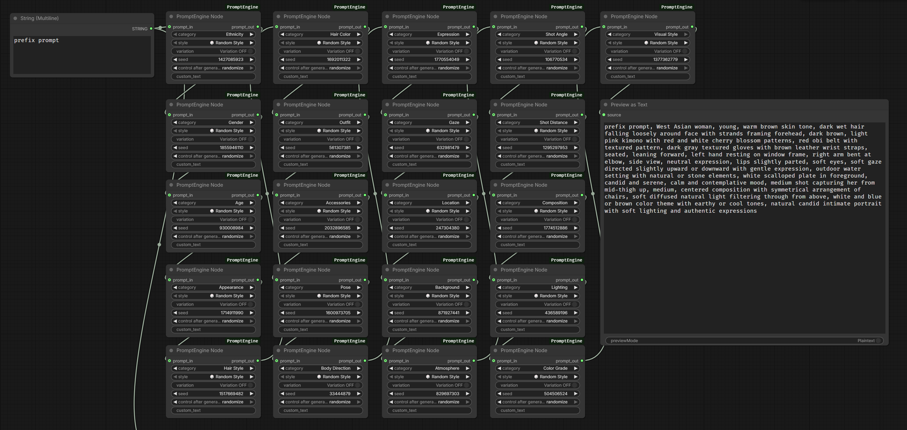
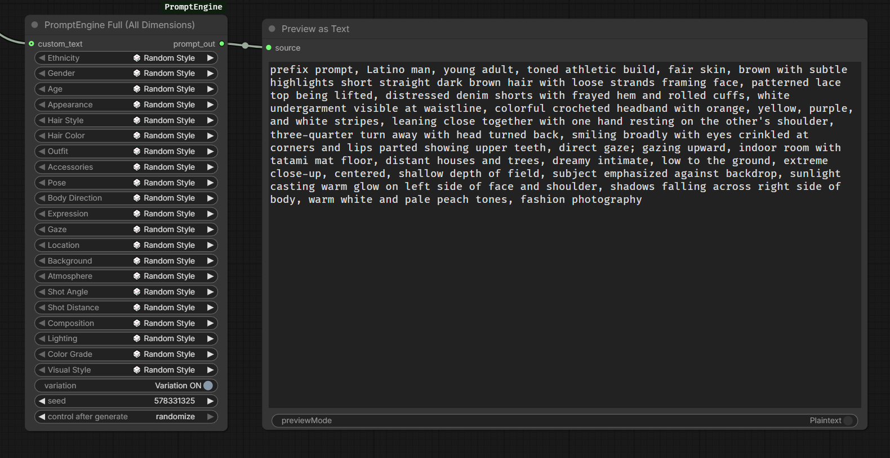
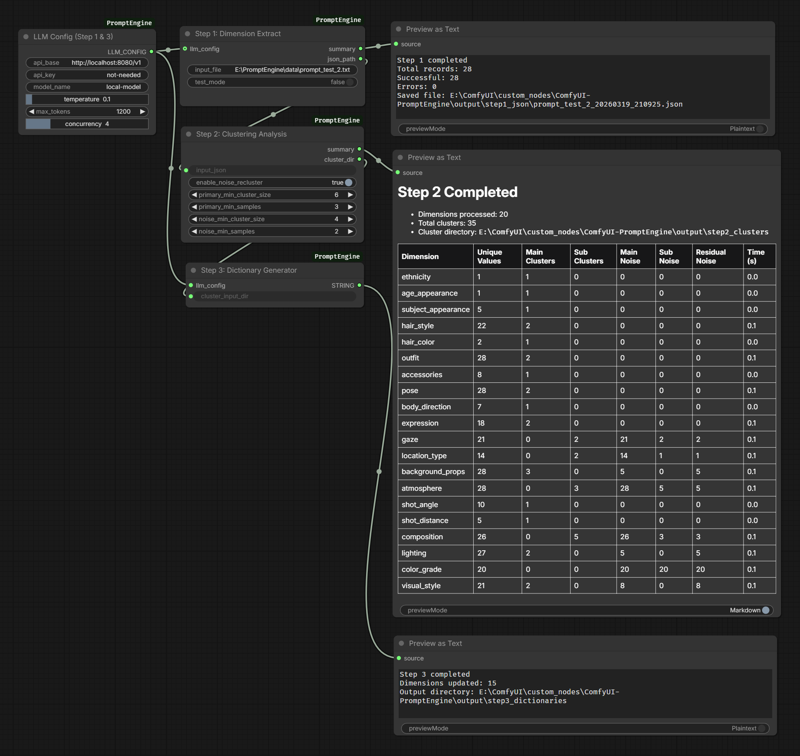

# ComfyUI-PromptEngine

适用于 ComfyUI 的词典式提示词组合插件，并内置 Step 1-3 词典生成工具链。

ComfyUI-PromptEngine 面向的是希望把提示词编辑做得更结构化、可复用、可扩展的用户，而不是长期维护一整条难以管理的自由文本 prompt。它将人物外观、服装、姿态、构图、光线、风格等 21 个视觉维度拆分为可管理的词典条目，同时保留手动覆盖输入的能力，兼顾规范化和灵活性。

插件同时提供两种主要使用方式：一种是可串联的单维度节点，适合模块化搭建工作流；另一种是全维度集中编辑节点，适合快速完成整条 prompt。对于需要持续扩充词典的用户，插件还内置 Step 1-3 工具链，可从原始 prompt 数据集中提取维度、聚类相近短语，并生成可在运行时与基础词典自动合并的用户增量词典。

[English](README.md)

## 功能概览

- 基于 21 个视觉维度，以结构化词典方式组合提示词。
- 同时提供单维度串联节点和全维度编辑节点。
- 可从现有 prompt 数据集中提取、聚类并生成自定义增量词典。
- 运行时自动合并插件自带基础词典与用户生成词典。

## 包含节点

- `PromptEngineNode`：按单个维度逐步拼接 prompt。
- `PromptEngineFull`：在一个节点中编辑全部支持维度。
- `LLMConfigNode`：为 Step 1 和 Step 3 提供统一的 OpenAI-compatible API 配置。
- `Step1DimensionExtract`：从原始 prompt 中提取结构化维度。
- `Step2Clustering`：对提取短语做 embedding + HDBSCAN 聚类。
- `Step3DictionaryGen`：根据聚类结果生成用户增量词典。

## 安装

将仓库克隆或复制到：

```text
ComfyUI/custom_nodes/ComfyUI-PromptEngine/
```

安装依赖：

```bash
pip install -r requirements.txt
```

安装完成后重启 ComfyUI。

## 依赖说明

基础依赖：

- `openai`
- `tqdm`

Step 1-3 工具链附加依赖：

- `sentence-transformers`
- `umap-learn`
- `hdbscan`
- `numpy`
- `torch`

说明：

- 如果你只使用 PromptEngine 组词节点，不需要 Step 2 的机器学习依赖。
- 如果本地没有 `BAAI/bge-small-en-v1.5`，Step 2 首次运行时可能会自动下载。
- Step 2 需要可用的 PyTorch 环境。

## 示例工作流

Prompt 组合：





词典生成：



示例工作流 JSON 位于 [`examples/`](examples/)。

## 使用说明

### Prompt 组合

- `PromptEngineNode` 通过 `prompt_in` 和 `prompt_out` 按维度逐步拼接 prompt。
- `PromptEngineFull` 在一个节点中展开全部支持维度，适合一次性完成整条 prompt 编辑。

#### PromptEngineNode

推荐用法：

- 按需添加你真正需要的维度，不必每次都使用全部 21 个维度。
- 通过 `prompt_in` 串联多个 `PromptEngineNode` 节点。
- 为了让生成出的 prompt 结构更稳定、更易读，也更方便后续维护，建议尽量保持接近插件内置的推荐维度顺序：
  `ethnicity -> gender -> age_appearance -> subject_appearance -> hair_style -> hair_color -> outfit -> accessories -> pose -> body_direction -> expression -> gaze -> location_type -> background_props -> atmosphere -> shot_angle -> shot_distance -> composition -> lighting -> color_grade -> visual_style`

主要参数说明：

- `category`：当前节点负责的视觉维度。
- `style`：当前维度选用的词典条目，也可以选择 `Random Style` 或 `skip`。
- `variation`：关闭时输出词典中的 `canonical_phrase`，开启时会从 `samples` 中随机抽样。
- `seed`：控制随机 style 和 sample 的选择结果，便于复现。
- `custom_text`：非空时会覆盖当前维度的词典选择，直接使用你手动输入的文本。
- `prompt_in`：来自上游 `PromptEngineNode` 的已有 prompt 文本。

使用建议：

- `PromptEngineNode` 更适合需要模块化控制的工作流，你可以决定哪些维度出现、哪些维度省略。
- 虽然可以自由调整节点顺序，但保持统一维度顺序会更方便排查、比较和复用 prompt。
- 如果你只是想临时手写某个维度的内容，优先使用 `custom_text`，不必立刻去改词典。

#### PromptEngineFull

推荐用法：

- 如果你更习惯在一个节点里完成整条 prompt 的编辑，使用 `PromptEngineFull` 会更高效。
- 它适合做工作流预设、快速试风格，或者检查当前词典在各维度上的覆盖情况。

主要参数说明：

- 节点中为每个支持维度都提供了一个 style 选择器。
- `variation`：对节点内所有维度统一应用 `canonical_phrase` / `samples` 的切换逻辑。
- `seed`：控制节点内全部随机选择结果。
- `custom_text`：作为自由文本前缀使用，适合补充词典体系之外的描述。

使用建议：

- `PromptEngineFull` 操作更快，但不如多节点串联那样模块化。
- 如果你希望获得单节点的 prompt 编辑体验，它通常是默认更方便的选择。
- 如果你需要按维度做图级复用、分支控制或组合式搭建，仍然更推荐 `PromptEngineNode`。

特殊行为：

- `gender` 是内置维度，固定为 `man` / `woman`。
- 相邻的 `ethnicity` 与 `gender` 会自动合并成一个短语。

### Step 1-3 词典工作流

```text
prompts.txt
  -> Step1DimensionExtract
  -> output/step1_json/*.json
  -> Step2Clustering
  -> output/step2_clusters/<dim>/<dim>_clusters.json
  -> Step3DictionaryGen
  -> output/step3_dictionaries/<dim>_dict.json
```

- Step 1 的输入必须是纯文本文件，并且每一行都必须是一条完整 prompt。
- 输入内容应当是 prompt 数据集，而不是零散关键词列表或拆碎的短语列表。
- 为了获得更好的结果，建议每条原始 prompt 尽量包含目标 21 个维度中的大部分内容，至少也应覆盖其中的大多数。若原始 prompt 信息过于稀疏、只包含少量属性，会直接降低维度提取覆盖率，也会影响后续聚类和词典生成质量。
- Step 2 按维度对提取结果做聚类。
- Step 3 只生成用户增量词典，不会覆盖插件自带基础词典。

建议的 Step 1 输入方式：

- 一行就是一条完整 prompt。
- 不要把同一条 prompt 拆成多行碎片。
- 尽量让原始 prompt 自带人物外观、服装、姿态、场景、镜头、光线、色调、风格等信息。
- 原始 prompt 覆盖维度越完整，后续的维度提取、聚类结果和词典质量通常越好。

运行时插件会自动合并：

- `dim_dictionaries/` 中的基础词典
- `output/step3_dictionaries/` 中的用户词典

Step 3 完成后，后端会立即读取到新词典；前端下拉选项需要刷新页面后才会显示新增内容。

## 输出目录

```text
output/
├── step1_json/
├── step2_clusters/
└── step3_dictionaries/
```

这些目录属于运行时产物。除非你明确想保留生成结果，否则通常不需要提交到仓库。

## 验证

```bash
python test_nodes.py
python -m py_compile nodes.py tools/*.py test_nodes.py
```

## 当前限制

- 如果本地没有 embedding 模型，Step 2 首次运行可能需要联网下载。
- 前端词典下拉框有缓存，刷新 ComfyUI 页面后才会显示新增选项。
- Step 3 当前更偏向增量生成，而不是重度人工标准化。

## 更新记录

版本变更记录见 [CHANGELOG.md](CHANGELOG.md)。

## 维护者说明

GitHub 发布和 ComfyUI Registry 上架步骤见 [PUBLISHING.md](PUBLISHING.md)。
